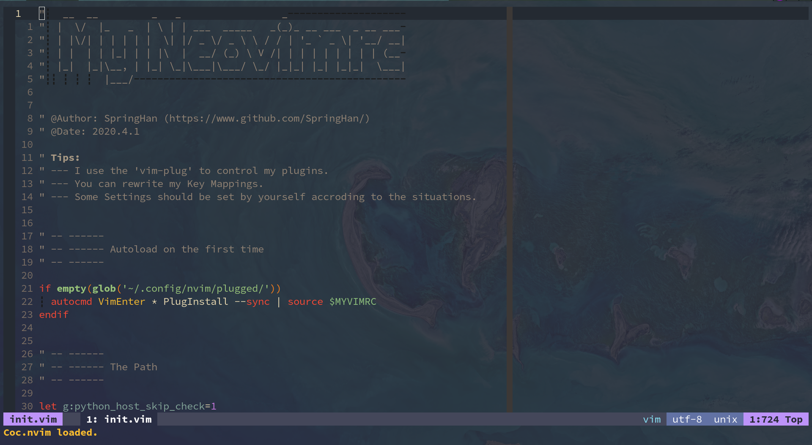
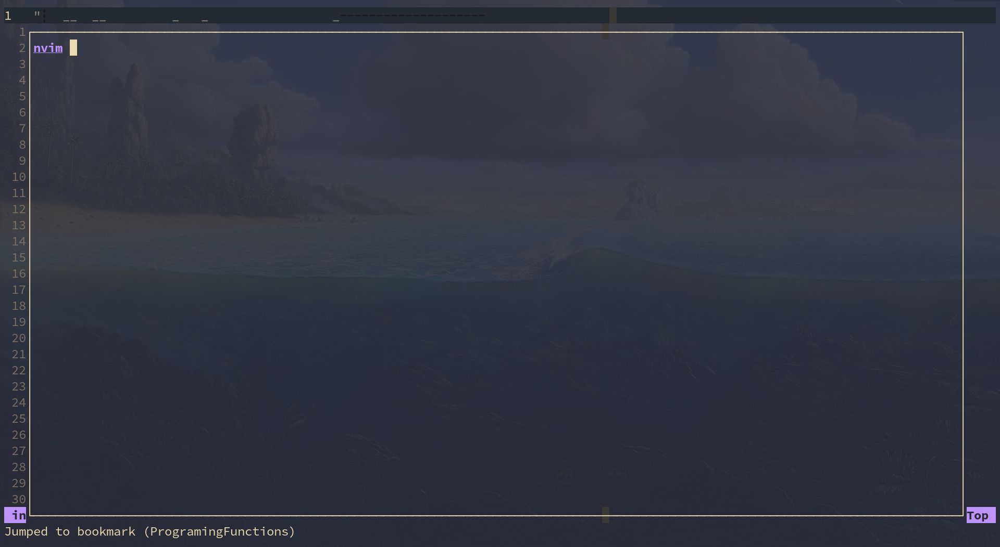
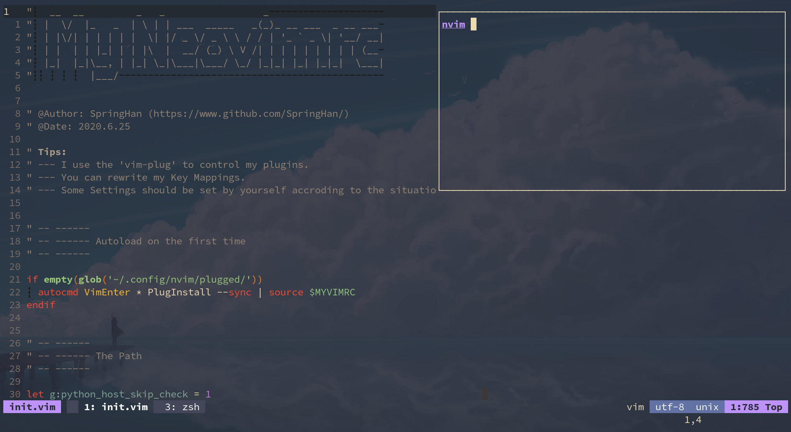

# My Neovim Configuration

These are my NeoVim's configuration files. (I'm a colemak user.)

If you want to use my configuration, please make sure you can understand it. Otherwise you may have some problems.

There is one of the screenshots:


## Guide

- [Plugins](#plugins)
- [Before Using](#before-using)
- [Key mappings](#key-mappings)
- [My custom functions](#my-custom-functions)

## Plugins

My Plugins Manager is **[vim-plug](https://github.com/junegunn/vim-plug)** .

#### My Plugins

- [vim-startify](https://github.com/mhinz/vim-startify) - A nice startify
- [HicusLine](https://github.com/Styadev/HicusLine) - A highly customizable statusline in (neo)vim
- [Terslation.vim](https://github.com/SpringHan/Terslation.vim) - Terminal Translator interface for vim
- [Deus](https://github.com/ajmwagar/vim-deus) - A better color scheme for the late night coder(I did some changes on the original,you can [Look Here](https://github.com/SpringHan/vim-deus))
- [vim-javascript](https://github.com/pangloss/vim-javascript) - A vim plugin provides javascript syntax
- [Tagbar](https://github.com/majutsushi/tagbar) - A plug can show the functions in vim
- [Far](https://github.com/brooth/far.vim) - A great plug which can do a good job on finding in vim
- [Auto-Pairs](https://github.com/jiangmiao/auto-pairs) - A plug that can insert or delete brackets, parens, quotes in pair
- [vim-easy-align](https://github.com/junegunn/vim-easy-align) - A plug that can center code easily
- [coc.vim](https://github.com/neoclide/coc.vim) - A completor in vim
- [vim-table-mode](https://github.com/dhruvasagar/vim-table-mode) - A Plugin which can help you format the tables.
- [markdown-preview.nvim](https://github.com/iamcco/markdown-preview.nvim) - A markdown previewer
- [Undotree](https://github.com/mbbill/undotree) - A plugin which can save the editing histroy
- [emmet-vim](https://github.com/mattn/emmet-vim) - Emmet for vim
- [fzf](https://github.com/junegunn/fzf) - Fuzzy finder in vim
- [vim-illuminate](https://github.com/RRethy/vim-illuminate) - A tool for illuminating the other uses of the current word under the cursor.
- [vim-multiple-cursors](https://github.com/terryma/vim-multiple-cursors) - True Sublime Text multiple selection in Vim
- [rnvimr](https://github.com/kevinhwang91/rnvimr) - Ranger in vim with float window
- [vim-surround](https://github.com/tpope/vim-surround) - A plugin which can change the symbol easily
- [vim-bookmarks](https://github.com/MattesGroeger/vim-bookmarks) - A Vim plugin for using line-based bookmarks
- [suda.vim](https://github.com/lambdalisue/suda.vim) - A plugin can make you use sudo in neovim
- [vim-capslock](https://github.com/SpringHan/vim-capslock) - A plugin can easily change the case
- [goyo.vim](https://github.com/junegunn/goyo.vim) - A plugin make you distraction-free writing in Vim
- [NoToC.vim](https://github.com/SpringHan/NoToC.vim) - A plugin can control the notes and todos in (Neo)Vim
- [NerdCommenter](https://github.com/preservim/nerdcommenter) - Vim plugin for intensely nerdy commenting powers
- [vim-pdf](https://github.com/makerj/vim-pdf) - A plugin make your vim browse the pdf files
- [vim-hexokinase](https://github.com/RRethy/vim-hexokinase) - The fastest (Neo)Vim plugin for asynchronously displaying the colours in the file


## Before using

#### Check the environment

1. [ ] Python and Python3 installed
2. [ ] pynvim installed

#### To check the "health"

You can run `:checkhealth` in vim to check if your NeoVim work well.

#### Set your Python path

You can find the python path or the python3 path in the `init.vim` , and then input your Python3 path.

Like this:
```vim
let g:python_host_prog = '/bin/python'
let g:python3_host_prog = '/bin/python3'
```

## Key Mappings

You can run `:map` to get all the keybingdings in my NeoVim.

## My custom functions

### Transparent

You can use `<leader>la` to turn the backgroud into transparent or untransparent.  
Example:



### Float Terminal

In my settings, you can use `<leader>Ft` to show the Float Terminal.  
Example:



And you can use `<leader>Fs` to show the Float Terminal on the top right.  
Like this:



You can use `<M-a>` transformation between the first and the second in the Terminal.

### Run codes

In my settings, you can use `<leader>r` to run different programming programs.

```vim
 _   _                 _           
| \ | | ___  _____   _(_)_ __ ___  
|  \| |/ _ \/ _ \ \ / / | '_ ` _ \ 
| |\  |  __/ (_) \ V /| | | | | | |
|_| \_|\___|\___/ \_/ |_|_| |_| |_|
```
