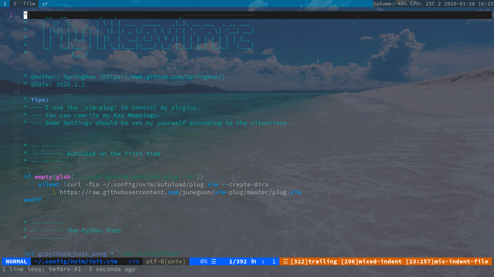

# My Neovim Configuration

This is my Neovim's Configuration files.

First,look an example:



(I'm a colemak user.)

## Plugins

My Plugins Manager is **[vim-plug](https://github.com/junegunn/vim-plug)**,I really like this manager. (And it's master is also very good.)

#### My Plugins

- [vim-startify](https://github.com/mhinz/vim-startify) - A nice startify
- [HicusLine](https://github.com/Styadev/HicusLine) - A highly customizable statusline in (neo)vim
- [LightTodo.vim](https://github.com/SpringHan/lightTodo.vim) - A light todolist in (neo)vim written by me
- [Terslation.vim](https://github.com/SpringHan/Terslation.vim) - Terminal Translator interface for vim
- [Deus](https://github.com/ajmwagar/vim-deus) - A better color scheme for the late night coder(I did some changes on the original,you can [Look Here](https://github.com/SpringHan/vim-deus))
- [vim-javascript](https://github.com/pangloss/vim-javascript) - A vim plugin provides javascript syntax
- [Tagbar](https://github.com/majutsushi/tagbar) - A plug can show the functions in vim
- [Far](https://github.com/brooth/far.vim) - A great plug which can do a good job on finding in vim
- [Auto-Pairs](https://github.com/jiangmiao/auto-pairs) - A plug that can insert or delete brackets, parens, quotes in pair
- [vim-easy-align](https://github.com/junegunn/vim-easy-align) - A plug that can center code easily
- [coc.vim](https://github.com/neoclide/coc.vim) - A completor in vim
- [vim-table-mode](https://github.com/dhruvasagar/vim-table-mode) - A Plugin which can help you format the tables.
- [markdown-preview.nvim](https://github.com/iamcco/markdown-preview.nvim) - A markdown previewer
- [Undotree](https://github.com/mbbill/undotree) - A plugin which can save the editing histroy
- [emmet-vim](https://github.com/mattn/emmet-vim) - Emmet for vim
- [fzf](https://github.com/junegunn/fzf) - Fuzzy finder in vim
- [vim-illuminate](https://github.com/RRethy/vim-illuminate) - A tool for illuminating the other uses of the current word under the cursor.
- [vim-multiple-cursors](https://github.com/terryma/vim-multiple-cursors) - True Sublime Text multiple selection in Vim
- [rnvimr](https://github.com/kevinhwang91/rnvimr) - Ranger in vim with float window
- [vim-surround](https://github.com/tpope/vim-surround) - A plugin which can change the symbol easily
- [vim-bookmarks](https://github.com/MattesGroeger/vim-bookmarks) - A Vim plugin for using line-based bookmarks
- [suda.vim](https://github.com/lambdalisue/suda.vim) - A plugin can make you use sudo in neovim


## Plugins provider

#### The most important step

- You can input `:checkhealth` in vim to check if your neovim work well.

#### Set your Python3 path

You can find the python path or the python3 path in the `init.vim`,and then input your Python3 path.

Like this:
```vim
let g:python_host_prog = '/bin/python'
let g:python3_host_prog = '/bin/python3'
```

#### Some other custom settings

You can find __Line 87__ in the `init.vim` to set your own `leader`.


## Key Mappings

These are my Key Mappings,of course you can change them.

| Insert Key | origin Key |
|------------|------------|
| ;;         | ESC A ;    |
| .,         | ESC A      |
| .fl        | {{{        |
| .fn        | }}}        |
| ?a         | ESC la     |
| ?O         | ESC O      |
| ?o         | ESC o      |
| ?I         | ESC I      |
| ?h         | ESC i      |
| ,x         | ESC xa     |
| .x         | ESC lxa    |
| ,X         | ESC xi     |
| .X         | ESC lxi    |

| Normal Key | origin Key       |
|------------|------------------|
| n          | h                |
| i          | l                |
| u          | k                |
| e          | j                |
| h          | i                |
| U          | 5k               |
| E          | 5j               |
| N          | 5h               |
| I          | 5l               |
| l          | u                |
| L          | e                |
| k          | n                |
| K          | N                |
| H          | I                |
| cl         | :bp CR           |
| cn         | :bn CR           |
| cw         | :w CR            |
| cq         | :q CR            |
| wq         | :wq CR           |
| wa         | :qa CR           |
| eq         | :q! CR           |
| bf         | :buffers CR      |
| et         | :edit            |
| sp         | :split           |
| vs         | :vsplit          |
| va         | C-w +            |
| vr         | C-w -            |
| ve         | C-w =            |
| vj         | C-w j            |
| vk         | C-w k            |
| vh         | C-w h            |
| vl         | C-w l            |
| tm         | :terminal CR     |
| bd         | :bd CR           |
| cd         | :noh CR          |
| leader-r   | RunCodes         |
| leader-tm  | :TableModeToggle |


## The End

Hope you can use these well.

```vim
 _   _                 _           
| \ | | ___  _____   _(_)_ __ ___  
|  \| |/ _ \/ _ \ \ / / | '_ ` _ \ 
| |\  |  __/ (_) \ V /| | | | | | |
|_| \_|\___|\___/ \_/ |_|_| |_| |_|
```
