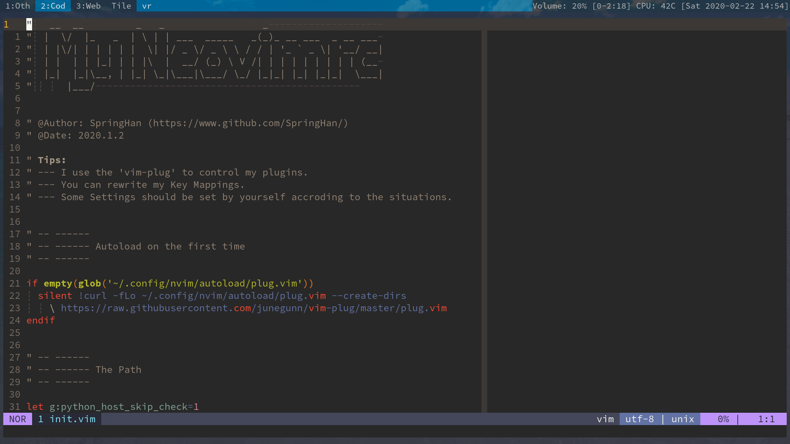
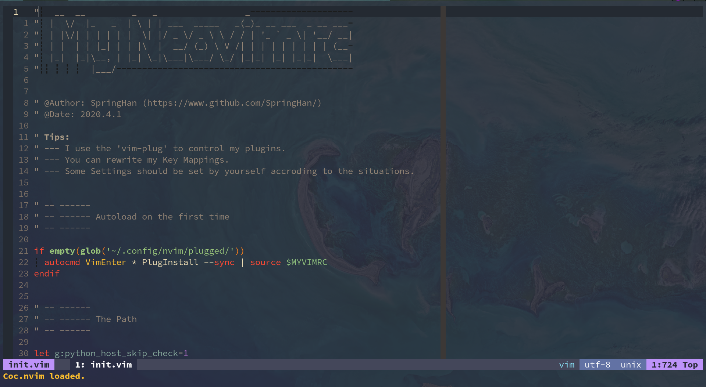
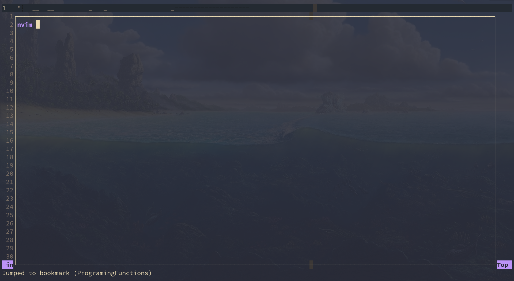

# 我的 NeoVim 配置文件

[**English version**](README.md)

此仓库存放了我的 NeoVim 配置文件 (我是一个 Colemak 用户)

如果你想使用我的配置文件, 请确保你能读懂它, 否则你很有可能会遇到问题



## 攻略

- [插件](#plugins)
- [使用之前](#before-using)
- [快捷键](#key-mappings)
- [自定义函数](#my-custom-functions)

## 插件

我的插件管理器是 **[vim-plug](https://github.com/junegunn/vim-plug)** .

#### 我的插件

- [vim-startify](https://github.com/mhinz/vim-startify) - A nice startify
- [HicusLine](https://github.com/Styadev/HicusLine) - A highly customizable statusline in (neo)vim
- [Terslation.vim](https://github.com/SpringHan/Terslation.vim) - Terminal Translator interface for vim
- [Deus](https://github.com/ajmwagar/vim-deus) - A better color scheme for the late night coder(I did some changes on the original,you can [Look Here](https://github.com/SpringHan/vim-deus))
- [vim-javascript](https://github.com/pangloss/vim-javascript) - A vim plugin provides javascript syntax
- [Tagbar](https://github.com/majutsushi/tagbar) - A plug can show the functions in vim
- [Far](https://github.com/brooth/far.vim) - A great plug which can do a good job on finding in vim
- [Auto-Pairs](https://github.com/jiangmiao/auto-pairs) - A plug that can insert or delete brackets, parens, quotes in pair
- [vim-easy-align](https://github.com/junegunn/vim-easy-align) - A plug that can center code easily
- [coc.vim](https://github.com/neoclide/coc.vim) - A completor in vim
- [vim-table-mode](https://github.com/dhruvasagar/vim-table-mode) - A Plugin which can help you format the tables.
- [markdown-preview.nvim](https://github.com/iamcco/markdown-preview.nvim) - A markdown previewer
- [Undotree](https://github.com/mbbill/undotree) - A plugin which can save the editing histroy
- [emmet-vim](https://github.com/mattn/emmet-vim) - Emmet for vim
- [fzf](https://github.com/junegunn/fzf) - Fuzzy finder in vim
- [vim-illuminate](https://github.com/RRethy/vim-illuminate) - A tool for illuminating the other uses of the current word under the cursor.
- [vim-multiple-cursors](https://github.com/terryma/vim-multiple-cursors) - True Sublime Text multiple selection in Vim
- [rnvimr](https://github.com/kevinhwang91/rnvimr) - Ranger in vim with float window
- [vim-surround](https://github.com/tpope/vim-surround) - A plugin which can change the symbol easily
- [vim-bookmarks](https://github.com/MattesGroeger/vim-bookmarks) - A Vim plugin for using line-based bookmarks
- [suda.vim](https://github.com/lambdalisue/suda.vim) - A plugin can make you use sudo in neovim
- [vim-capslock](https://github.com/SpringHan/vim-capslock) - A plugin can easily change the case
- [goyo.vim](https://github.com/junegunn/goyo.vim) - A plugin make you distraction-free writing in Vim
- [NoToC.vim](https://github.com/SpringHan/NoToC.vim) - A plugin can control the notes and todos in (Neo)Vim
- [NerdCommenter](https://github.com/preservim/nerdcommenter) - Vim plugin for intensely nerdy commenting powers
- [vim-pdf](https://github.com/makerj/vim-pdf) - A plugin make your vim browse the pdf files
- [vim-hexokinase](https://github.com/RRethy/vim-hexokinase) - The fastest (Neo)Vim plugin for asynchronously displaying the colours in the file
- [vim-calendar](hhtps://github.com/itchyny/calendar.vim) - A calendar application of vim


## 使用之前

#### 检查环境

1. [ ] Python 和 Python3 已经安装
2. [ ] pynvim 已经安装

#### 检查"健康"

你可以在 vim 里运行 ":checkhealth" 以检查你的 NeoVim 工作是否正常

#### 设置 Python 路径

你可以找到 python 或 python3 的路径, 然后将它们输入到 `init.vim` 中

像这样:
```vim
let g:python_host_prog = '/bin/python'
let g:python3_host_prog = '/bin/python3'
```

## 快捷键

你可以在我的 NeoVim 中运行 ":map" 以获得我的所有键位

## 自定义函数

### 透明背景

你可以用 `<leader>la` 来将背景透明化或不透明化



### 悬浮终端

你可以用 `<leader>Ft` 来打开悬浮终端



你还可以用 `<leader>Fs` 来在右上角展示悬浮终端

像这样:


你可以用 `<M-a>` 在编辑器与终端进行切换

### 运行代码

你可以使用 `<leader>r` 来编译并运行不同的编程程序

```vim
 _   _                 _           
| \ | | ___  _____   _(_)_ __ ___  
|  \| |/ _ \/ _ \ \ / / | '_ ` _ \ 
| |\  |  __/ (_) \ V /| | | | | | |
|_| \_|\___|\___/ \_/ |_|_| |_| |_|
```
